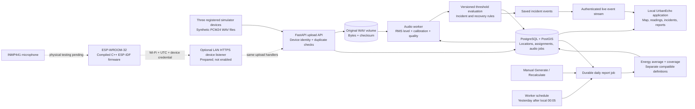

# UrbanEcho technical and operating guide

Prepared **9 October 2026, Asia/Kolkata**. This describes the implemented local prototype. For evidence dates and the difference between earlier tests and this documentation task, see [Current status](CURRENT-STATUS.md) and [Step 6 verification](../../STEP6-VERIFICATION.md).

## Product and current boundary

UrbanEcho helps **residential community management** see where excessive noise is being reported, review saved incidents, and understand the periods covered by daily readings. The proposed first users are community managers and the staff responsible for shared spaces. These are intended users, not confirmed customers or a completed residential pilot.

The working application provides a map, location/device status, reading history, saved incidents, opening notifications, management controls, and daily reports. Its verified end-to-end input is synthetic audio from registered simulator devices. Original WAV files and numerical results are stored. The system does not identify the source of a sound or prove that a resident violated a rule.

**Current deployment: local only.** Open [http://localhost:8000/app](http://localhost:8000/app) on the backend Mac. The optional local-network HTTPS upload listener is prepared but **not enabled for ongoing use**. There is no running ngrok tunnel or verified cloud deployment. The local browser opens automatically without asking the operator to paste an administrator token.

**Hardware: firmware compiled; physical integration and acoustic validation pending.** The board is on another computer. It can be built/flashed there, but no physical recording has been accepted as verified evidence yet.

## Architecture

The Mermaid source below is editable. Solid arrows show the software flow already exercised with simulated input; dashed arrows show the pending physical path. Both use the same ingestion and measurement implementation.



The worker calculates audio outside its database transaction, then commits the result, evaluation, incident change and event together. Browser notifications come from saved events. Daily aggregation uses a separate worker thread and never creates or rewrites live incident alerts.

| Component | Actual implementation and role |
|---|---|
| API | Python 3.12, FastAPI 0.143.0, Uvicorn 0.54.0; validation, registration, authenticated uploads and queries |
| Data access | SQLAlchemy 2.0.54, psycopg 3, GeoAlchemy2; PostgreSQL transactions and geographic queries |
| Database | PostgreSQL 17 / PostGIS 3.5; location coordinates, immutable assignments/rules, measurements, incidents, events and reports |
| Schema setup | Alembic migrations through `0004_daily_summaries`; runs before API/worker startup |
| Audio processing | Python worker, `pcm24-dc-rms-quality-v2`; DC-removed RMS, quality checks and optional calibration |
| Live updates | Persisted events plus Server-Sent Events (SSE); ordered replay and client deduplication |
| Daily processing | Database-backed report jobs, local-calendar boundaries, sound-energy and duration weighting |
| Application | HTML/CSS and native JavaScript modules; self-hosted Leaflet 1.9.4 with OpenStreetMap tiles; no frontend build step |
| Local operation | Docker Compose; database and original audio in separate persistent named volumes |
| Device project | C++ ESP-IDF v5.4.3, target `esp32`, plus a portable tested C++ core |

Exact Python pins are in [requirements.txt](../../requirements.txt). The [component reference](#component-reference) identifies source files.

## Start the local application

Prerequisites: Docker Desktop running with Compose v2, Python 3.10 or later for the simulator, enough local disk space for saved audio, and port 8000 available. The backend's Python 3.12 runtime is inside the container. Docker test overrides require Compose 2.24.4 or later. Node is only needed to run frontend tests; it is not needed to open the application.

Run commands from the `noise-monitor` project folder. On this Mac it is `~/Documents/Codex/2026-10-09/bu/outputs/noise-monitor`.

For a **new installation only**, create private settings:

```sh
python3 scripts/setup-env.py
```

This creates random database and administrator credentials in `.env` and refuses to overwrite an existing file. For the current installation, retain its existing `.env` and skip that command. [`.env.example`](../../.env.example) documents configuration names; it contains no usable credentials.

For this Apple Silicon Mac:

```sh
docker compose -f compose.yaml -f compose.amd64.yaml up -d --build
docker compose -f compose.yaml -f compose.amd64.yaml ps
```

On an Intel Mac, omit `-f compose.amd64.yaml`. The override supplies AMD64 compatibility for the selected PostGIS image. Compose waits for database health, runs migrations, then starts the API and worker. There is no manual table-creation step.

| Address on the backend Mac | Purpose |
|---|---|
| [http://localhost:8000/app](http://localhost:8000/app) | Main application; automatic local access |
| [http://localhost:8000/health/ready](http://localhost:8000/health/ready) | Database, migration and audio-storage readiness |
| [http://localhost:8000/health/live](http://localhost:8000/health/live) | API liveness |
| [http://localhost:8000/docs](http://localhost:8000/docs) | Technical API documentation; protected calls need appropriate credentials |

The API host port binds only to `127.0.0.1:8000`. PostgreSQL has no host port in the normal setup. Keep the Mac awake and Docker/API/worker running during demonstrations and scheduled processing.

`postgres_data` holds the database; `original_audio` holds WAV files. A normal `docker compose stop` retains both. **Do not use `down --volumes` to restart or update this installation.** Before an upgrade or restore, back up database and audio together; follow the [README's backup instructions](../../README.md#storage-backup-and-shutdown). Also preserve private device registration files separately. Changing passwords in `.env` does not rotate an already initialized database's passwords.

## Locations, devices and rules

1. In **Management → Locations**, enter a name, latitude, longitude and IANA timezone such as `Asia/Kolkata`, then choose the initial measurement type, threshold, one-second interval and recovery count. Coordinates refer to the monitoring location, not the server.
2. In **Devices**, register a device against that location. Its private token is returned once. For physical provisioning, prefer the [hardware registration helper](../../docs/HARDWARE-INTEGRATION.md#prepare-the-backend-mac), which writes a private configuration file instead of putting credentials in a document.
3. In **Thresholds**, choose the location and edit its rule. Changes are versioned. Old readings and incidents retain their original rule and location context. Reassignment also creates a historical assignment rather than relocating old records.
4. Physical devices initially have no SPL calibration. Use **dBFS digital level** for a bench transmission check, with a deliberately chosen digital threshold. A numerical test calibration must never be copied from a simulator to a real microphone.

A breach means the **stored, unrounded value is strictly greater than the threshold**. An exactly equal reading is normal. Sustained excessive readings update one open incident. The default recovery rule requires three eligible normal recordings with matching session/calibration and contiguous sequence numbers and capture windows. A gap, invalid recording or new session breaks that continuity.

Stopping a device makes it stale, normally after 30 seconds from its last eligible capture. **Stale is not recovered**: an unresolved noise incident remains unresolved. Delayed captures beyond the default 120-second live window and future captures are preserved as historical evidence without current alerts. These timing limits have separate meanings and can be configured.

## Repeatable simulator and daily reports

The preserving verification runner is:

```sh
python3 scripts/verify-simulator.py --hold-seconds 4
```

Open the application first. It reuses the three private simulator registrations and current rules, exercises equality, breach, sustained noise, duplicates, staleness and recovery, then checks saved daily results. The current demo thresholds are **North garden 60, Workshop 60, East gate 62 dB SPL (Z)**. Names and calibration versions explicitly identify simulated data. For a presentation where only Workshop becomes excessive, use `python3 scripts/verify-simulator.py --focus-station workshop --hold-seconds 10`; all three devices still participate. See the [presenter walkthrough](DEMO-WALKTHROUGH.md) for the product demonstration and [simulator reference](../../SIMULATOR-VERIFICATION.md) for expected phases.

Repeating the whole demonstration intentionally adds a new sequence of saved recordings/incidents. Retrying the same recording within a run does not. The runner preserves unrelated data and does not reset thresholds. Do not run competing simulators on the same fixture devices. The older `demo-application.py` is a legacy example that resets only its own fixtures to 60; it is not the preserving demonstration recommended here.

In **Daily reports**, select a location and local date, then **Generate summary** or **Recalculate summary**. Previously saved results load automatically. A new request is queued; the worker saves results that survive refreshes/restarts. Today is provisional, a short recording period is partial coverage, and no usable readings produce **No usable data**, not a zero sound level.

The automatic job checks every 60 seconds and queues each location's previous completed day after **00:05 in that location's timezone**. It catches up yesterday when the worker restarts and finalizes an earlier provisional report. Older missed days and late/reprocessed data for finalized reports need manual recalculation. The Mac and worker must be running; this is not a cloud scheduler.

Default schedule settings: `DAILY_SCHEDULE_ENABLED=true`, `DAILY_SCHEDULE_MINUTE=5`, `DAILY_SCHEDULE_POLL_SECONDS=60`, `DAILY_JOB_LEASE_SECONDS=600`, `DAILY_JOB_MAX_ATTEMPTS=5`. Setting scheduling off leaves manual processing available. Durable leases permit retry after interruption, and unique location/date/definition keys prevent duplicate summaries.

The prepared historical demo contains explicitly labelled synthetic recordings for **8 and 9 October 2026**, including invalid silence and a midnight-crossing recording. The replay script uses the real upload/processing path and refuses captures still inside the live window. It does not manufacture past incidents. See [the historical replay instructions](../../README.md#repeatable-historical-demonstration).

## What the measurements mean

| Result | Meaning and eligibility |
|---|---|
| `dbfs_rms`, weighting `none`, unit dBFS | DC-removed digital signal level relative to full scale. Useful for transmission/processing checks; not environmental sound pressure and not comparable across arbitrary microphone/gain chains. |
| `spl_z_leq`, weighting `Z`, unit dB SPL (Z) | A whole-recording equivalent level derived with applicable saved calibration. A trustworthy physical result still depends on real calibration and independent validation of the hardware. |
| Simulated | Numerical fixture and synthetic calibration exercise software. They are never a claim of measured environmental sound. |
| Invalid or missing | Silence, clipping, failed processing, mismatched definitions/intervals, bad attribution and inapplicable calibration are excluded from eligible averages/alerts. Saved diagnostics explain why. |

The system does not silently relabel either method as **dBA** and does not claim certified regulatory measurement. A full-scale sine is about −3.01 dBFS. Zero digital samples produce a null level/quality diagnostic, not negative infinity or a trustworthy silent environmental measurement.

For non-overlapping eligible recordings, the daily energy average is:

```text
10 × log10( Σ(duration × 10^(level / 10)) / Σ(duration) )
```

Equal-length readings of 50 and 60 dB yield approximately **57.40 dB**, not 55 dB. Minimum/maximum are recording-level extrema, not instantaneous waveform peaks. Eligible measurement count, saved incident starts, summed recorded duration, usable union duration, coverage, exclusions and calculation time accompany the result.

Calculation rules:

- Local days run from local midnight up to the next midnight. The first report request freezes its timezone and UTC boundaries; DST days can be 23 or 25 hours. A midnight-crossing chunk is divided by its overlapping duration, assuming uniform energy within that chunk.
- Reprocessing uses the newest persisted measurement revision. An invalid replacement does not fall back silently to an earlier valid value. A chunk crossing a historical location-assignment boundary is excluded because its whole-chunk level cannot safely be split across places.
- Overlapping chunks are energy-averaged within each device, then compatible calibrated devices receive equal weight per time segment. This is a declared location-summary rule, not addition of physical sound sources. dBFS stays device-specific.
- Simulation class, measurement method, weighting, channel policy and processor version separate incompatible summary cards. A saved `recorded` class means no simulation marker was found; it does not certify physical origin or calibration.
- Coverage is the union of usable recording intervals divided by the actual local day length. Overlap cannot inflate coverage above 100%. Missing time is never filled with silence or estimated noise. Today's denominator is the entire day, so its provisional result includes future unsampled time.
- Incident counts represent saved incidents that **started** in that day. They do not reconstruct breaches from historical audio, and identical scoped counts can repeat across processor-version cards; do not add those cards' incident counts together.

See [the complete daily rules](../../README.md#daily-processing-use-and-calculation-rules) for exclusions, snapshots, retries and persistence details.

## Physical device preparation

Confirmed components: **ESP-WROOM-32 development board with Micro-USB** and **INMP441 I²S microphone**. The exact carrier revision, USB bridge and flash capacity are not independently confirmed. Use GPIO labels rather than assumed header positions.

| INMP441 | Confirmed connection |
|---|---|
| VDD | ESP 3.3 V |
| GND | ESP GND |
| SCK / BCLK | GPIO 26 |
| WS / LRCLK | GPIO 25 |
| SD | GPIO 33 |
| L/R | GND, left slot |

The full [hardware guide](../HARDWARE-INTEGRATION.md) cites the component specifications, registration and optional HTTPS setup. The device and backend Mac must share a reachable local network; the computer used for flashing does not need to remain attached afterward. `localhost` is never the ESP's backend address.

On the flashing computer, use the complete `firmware/esp32` and adjacent `firmware/common` folders. Privately supply the registered device JSON and server **public CA certificate**, set Wi-Fi SSID/password, correct HTTPS backend address and verified pin profile, then use an activated **ESP-IDF v5.4.3** terminal:

```sh
python3 firmware/esp32/configure.py --config .local/hardware-device.json --ca .local/hardware-tls/ca.crt
idf.py -C firmware/esp32 set-target esp32
idf.py -C firmware/esp32 build
idf.py -C firmware/esp32 -p YOUR_SERIAL_PORT flash monitor
```

Before flashing, read the actual chip/flash identity and adjust the supplied 4 MB flash assumption if needed, as described in [firmware setup](../../firmware/esp32/README.md). Do not flash a compile-check configuration. Credentials are embedded in the configured development binary, so keep that binary and generated header private.

The current supported firmware profile is **one-second recordings at 16 kHz**: 48,044 bytes per mono PCM24 WAV. Recording and upload cadence are configurable; increasing the gap reduces coverage and can break contiguous recovery. Two fixed audio slots use about 96 KB. Overflow drops are counted in serial diagnostics. The queue and counters are RAM-only; power loss clears unacknowledged recordings. Larger recording durations/rates need a reviewed memory/profile change, even though the backend accepts more formats within its limits.

Firmware waits for usable SNTP time, timestamps the first sample, authenticates with the device credential, and retries with the same immutable recording identity and bytes. Successful transmission verifies connectivity and server processing. It does **not** establish microphone accuracy. Physical calibration of the actual microphone/assembly, followed by independent comparison, remains required before claiming trustworthy environmental SPL.

## Upload and API reference

`POST /audio` takes device Bearer authentication and multipart fields `metadata` and `file`. Metadata contains `device_id`, `chunk_id`, `session_id`, nonnegative integer `sequence`, and timezone-aware `captured_at` for the first sample. Identifiers must be stable on retry. WAV requirements: ordinary RIFF PCM format 1, 16-byte `fmt` chunk, mono packed signed 24-bit little-endian samples. Defaults accept 16/32/44.1/48 kHz, at most 60 seconds and a 20,000,000-byte audio file. The actual duration must match the location rule for eligible evaluation.

| Route | Use |
|---|---|
| `POST/GET /locations`; `PATCH /locations/{id}` | Registration and version-checked location changes |
| `GET/PATCH /locations/{id}/threshold` | Read/change a location's versioned rule |
| `POST/GET /devices`; `PATCH /devices/{id}` | Device registration, assignment, enablement and calibration |
| `POST /audio` | Device upload; 202 accepted, 200 identical duplicate, 409 conflicting reuse |
| `GET /audio/{id}`; `GET /audio/{id}/file` | Processing details and preserved original; owner device or administrator Bearer credential |
| `GET /measurements`; `GET /incidents` | Saved filtered/paginated history |
| `GET /locations/status`; `GET /events/stream` | Consistent state snapshot and authenticated live/replay events |
| `GET /daily-summaries?location_id=UUID&reporting_date=YYYY-MM-DD` | Read a saved report; omitted date means local yesterday |
| `POST /daily-summaries/generate` | Queue/recalculate using a JSON `location_id` and `reporting_date`; returns 202 |
| `GET /daily-summaries/jobs/{report_id}` | Read job status and saved result |

The main application handles its local session automatically. API tools use existing administrator authentication; devices use their own credentials. Never place either token in URLs, examples, slides or screenshots.

## Security, storage and operating limits

Automatic local access is deliberately limited to the loopback-bound application with same-origin checks and an HttpOnly signed session. It is not a shared-user login system. There are no organization accounts, tenant isolation, role-based resident access, paid subscriptions or public deployment in this prototype.

The optional device listener permits authenticated upload and owner recording inspection; it excludes the application, management routes and administrator credentials. Its certificate must match the Mac's private IP and the firmware must verify its CA. Preparation instructions do not mean the listener is currently running.

Original audio is retained, and could contain intelligible speech in a real deployment. Retention/deletion policy, access governance, disk budgets and a backup/restore routine require operator decisions before a residential pilot; automatic audio retention deletion is not implemented. Map tile requests disclose the viewed map area to the tile provider, though they do not include application credentials. The application retains its location list if tiles fail.

Continuous recording is materially larger than the short demonstration: at the current profile, one device producing one WAV each second generates about **4.15 GB/day** of audio-file bytes before database, filesystem, backups or replication overhead (decimal GB). Actual recording cadence changes this volume. Load/soak capacity, field reliability, privacy suitability and acoustic accuracy are not established by passing unit tests.

## Troubleshooting

| Symptom | Check and next action |
|---|---|
| Application will not open | Start Docker and check Compose service status and `/health/ready`; keep the browser on the backend Mac's exact localhost URL. |
| Application asks for a token locally | Reload the current `/app`; confirm the loopback Compose API has local browser access enabled. Do not put the administrator token in frontend files or re-enable a tunnel. |
| Upload accepted but no new reading | Inspect the returned audio ID and worker status. 202 means queued, not finished; check quality/calibration/interval diagnostics. |
| No opening notification | Open the app before the breach and check connection/Incident history. Continued noise in the same incident does not create another opening popup. Historical audio does not create current notifications. |
| Location remains partly stale during simulation | Dedicated historical-replay devices are intentionally silent; inspect the live device's timestamp. Staleness does not mean saved history was lost. |
| Summary is queued, failed or empty | Keep the worker running; inspect the local date, usable measurements and exclusions. Recalculate after fixing a failure or adding late data. No usable data is an expected result for an empty day. |
| Wi-Fi or timestamp failure on ESP | Check 2.4 GHz WPA2-compatible network, private settings, reachability and DNS/NTP. No valid clock means no capture; do not substitute upload time. |
| TLS/authentication failure | Check clock, Mac IP, certificate SAN/expiry and public CA, then registered device ID/token and enabled state. Never bypass certificate verification. |
| 413/422 or 409 upload error | Check WAV/profile/duration/size and capture assignment; 409 means an ID conflicts with different content. Correct the cause rather than changing an old recording's identifier. |
| Audio is silent/clipped or only digital values appear | Check microphone power/left slot/packing and level diagnostics. Uncalibrated hardware cannot confirm SPL; use bench dBFS and then perform physical calibration. |
| Disk fills or data is missing | Stop new captures if necessary, inspect storage and restore a matching database/audio backup. Do not erase volumes as a repair step. |

## Component reference

- Configuration/startup: [compose.yaml](../../compose.yaml), [Dockerfile](../../Dockerfile), [app/config.py](../../app/config.py), [migrations](../../migrations/versions).
- Upload/storage/data model: [app/main.py](../../app/main.py), [app/audio.py](../../app/audio.py), [app/models.py](../../app/models.py), [app/auth.py](../../app/auth.py).
- Processing/live policy: [app/processing.py](../../app/processing.py), [app/worker.py](../../app/worker.py), [app/evaluation.py](../../app/evaluation.py), [app/configuration.py](../../app/configuration.py), [app/events.py](../../app/events.py), [app/live_api.py](../../app/live_api.py).
- Daily reports: [app/daily.py](../../app/daily.py), [app/daily_jobs.py](../../app/daily_jobs.py), [app/daily_api.py](../../app/daily_api.py), [migration 0004](../../migrations/versions/0004_daily_summaries.py).
- Web application: [app/application_api.py](../../app/application_api.py), [app/static/application](../../app/static/application).
- Simulator: [scripts/verify-simulator.py](../../scripts/verify-simulator.py), [scripts/demo-daily.py](../../scripts/demo-daily.py).
- Physical preparation: [firmware/esp32](../../firmware/esp32/README.md), [firmware/common](../../firmware/common/README.md), [compose.hardware.yaml](../../compose.hardware.yaml), [scripts/register-hardware.py](../../scripts/register-hardware.py), [scripts/check-device.py](../../scripts/check-device.py).

For planned acceptance work, see [Step 8 checklist](ACCEPTANCE-CHECKLIST.md). No physical test or production guarantee should be inferred from this guide.
